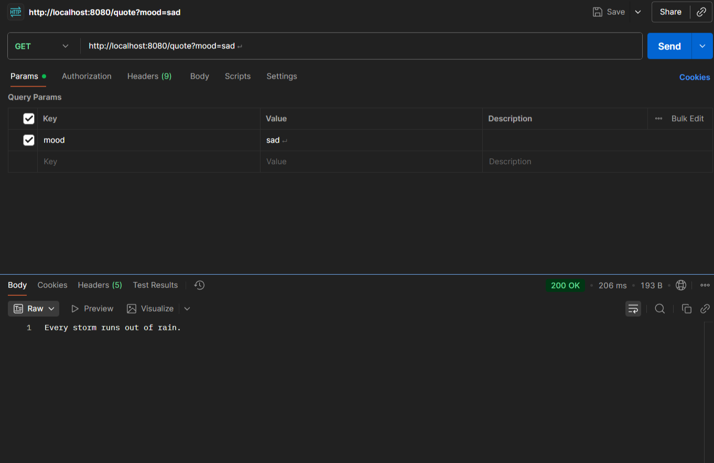

# 🎭 Mood to Quote API

A lightweight **Spring Boot** project that returns random quotes based on your mood.  
Built to brush up backend fundamentals and ship something small but complete 🚀  

---

## ✨ Features
- Returns a random quote for moods: **happy, sad, stressed, motivated**  
- Simple REST API using `@RestController` and `@GetMapping`  
- Randomized responses so every call feels fresh  
- Easy to run locally (just Maven + Spring Boot)  

---

## 🛠️ Tech Stack
- Java 17  
- Spring Boot (Web)  
- Maven  

---

## 🚀 Getting Started

### 1. Clone the repository
```bash
git clone https://github.com/adi-y/Mood-to-Quote.git
cd Mood-to-Quote

```

###2. Run the project
```bash
mvn spring-boot:run
```

### Server will start
```bash
http://localhost:8080
```




---

👉 This gives your project a **story + instructions + screenshot placeholder**.  
Once you add the screenshot inside `docs/`, the README will look very professional.  

Do you want me to also make a **short version of this README** (like a 30–40 line one) in case you feel this is too long for a small project?


